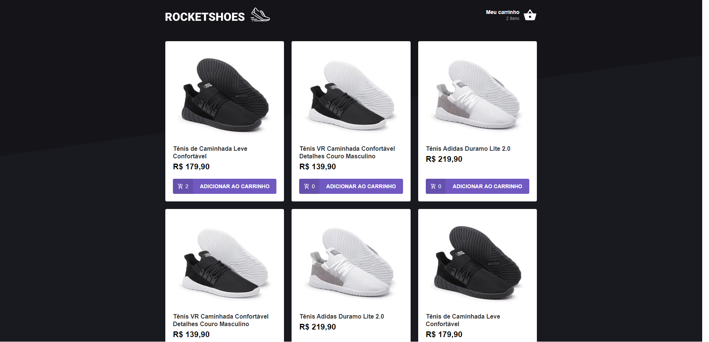
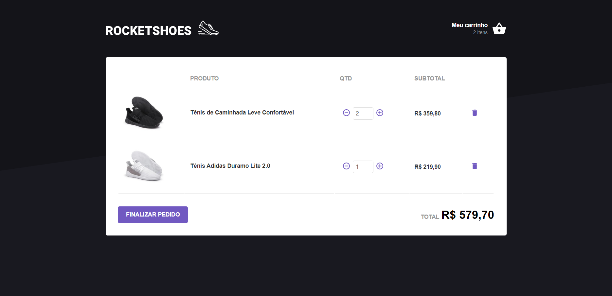

# Rocketshoes

### Aplicação desenvolvida durante o Bootcamp Gostack 10 da Rocketseat, foram utilizadas as tecnologias:

-   ReactJS

-   Redux

-   Redux Saga

-   Styled Components

-   JSON Server

## Home

## Carrinho

## Servidor

Para executar o servidor que simula um banco de dados basta executar o comando `yarn json-server server.json -p 3333` e ele será iniciado em http://localhost:3333
